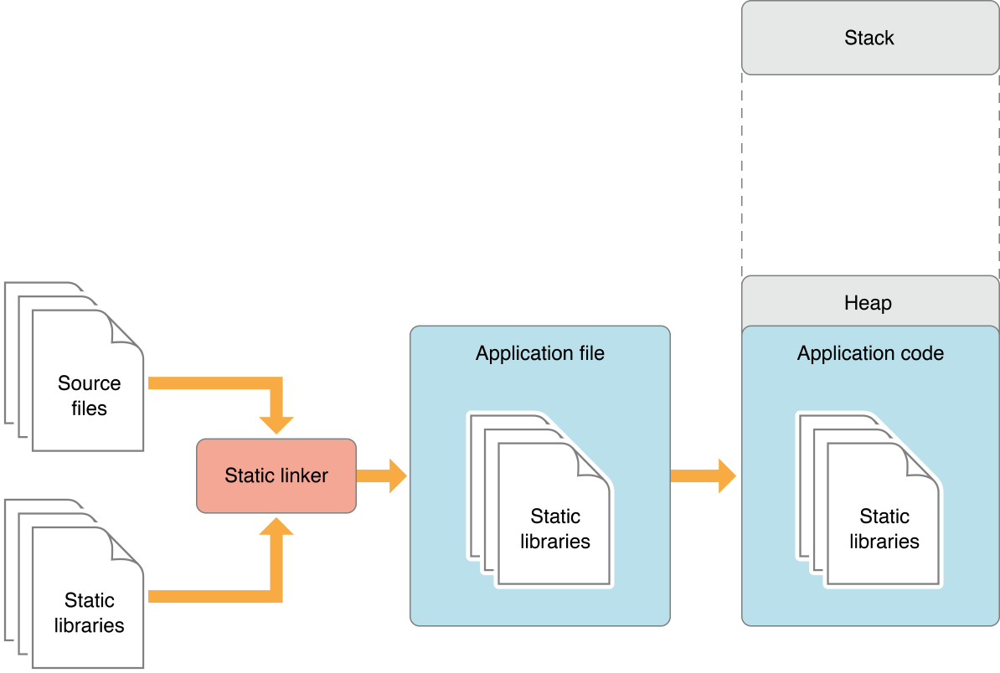

Package

> 패키지는 swift 파일들과 menifest 파일로 구성된다.

Library

> 프로그램이 link 할 수 있는 object 파일들의 집합이 묶음이 라이브러리다.

- static
- dynamic

간단한 관점에서의 차이는 통합(프로젝트에 링크) 방법이다.

Mach-O 파일 포맷
> 프로그램을 만들때 개발자는 소스코드를 목적 파일로 바꾼다. 목적 파일들은 실행 파일 또는 정적 라이브러리로 패키지된다.

기본적으로 Mach Object 포맷을 이용해 목적 파일을 만든다. 이 파일들은 어플리케이션, 프레임웍, 동적 정적 라이브러리의 핵심 블럭이다.

Linking libraries
> 링크는 여러 오브젝트 파일로부터 하나의 실행 파일을 생성하는 것
> 컴파일러가 모든 오브젝트 파일을 만든 후 그들을 실행 파일로 만드는 다른 프로그램이 호출된다.
> 링커라고 불리고 이 과정을 링킹이라고 한다.

Static linking

라이브러리의 소스코드는 말 그대로 어플리케이션의 소스에 복사된다. 이 때문에 excutable은 커지고, 로딩 시간이 길어져서 바이너리는 느리게 시작된다. 같은 라이브러리를 한 번 이상 link하려고 하면 symbol이 중복되어서 실패한다.

언제나 맞는 버전의 라이브러리를 사용할 수 있다는 것, 전체를 로드할 필요 없이 진짜 사용하는 부분만 복사되는 것이 장점이다.

Dynamic linking

동적 라이브러리는 바이너리의 소스에 포함되지 않는다. runtime에 로드된다. 이 때문에 바이너리는 작아질 수 있고 빠르게 로딩될 수 있다. 여러 개의 excutable가 공유할 수 있기 때문에 메모리를 적게 사용하게 도니다. 

동적 라이브러리그 없거나 버전이 맞지 않으면, 어플리케이션은 실행될 수 없다. 반면에 동적 라이브러리의 저자가 수정하면 앱은 재 컴파일 없이도 이점을 얻을 수 있다.

Framework

> dynamic shared library, nib, image, localized strings, header files, and reference documentation 같은 것들을 하나의 패키지로 캡슐화한 하나의 계층적 디렉터리가 framework 이다.

간단히 말하면, 프레임웍은 정적 또는 동적 라이브러리들이 추가 에셋, 메타 정보와 함께 하나의 번들로 쌓여진 것이다.

Module

> swift는 코드를 모듈들로 조직한다. 각각의 모듈은 namespace를 특정하고, access control을 적용한다.

import 키워드로 외부 모듈을 소스로 가져올 수 있다. 스위프트에서는 항상 프레임웍들을 모듈로 사용한다.

모듈 이전에는 프레임웍의 헤더를 직접 import해야 했고, 프레임워크 바이너리를 수동으로 링크해야했다. `#import` 매크로는 문자 그대로 모든 의존성 구조를 코드로 복사하고, 컴파일러는 큰 소스 파일에 대한 작업을 수행했다.

